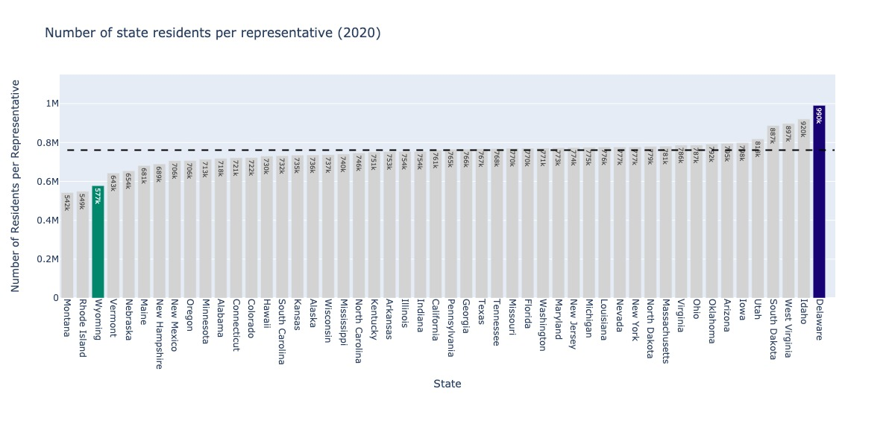
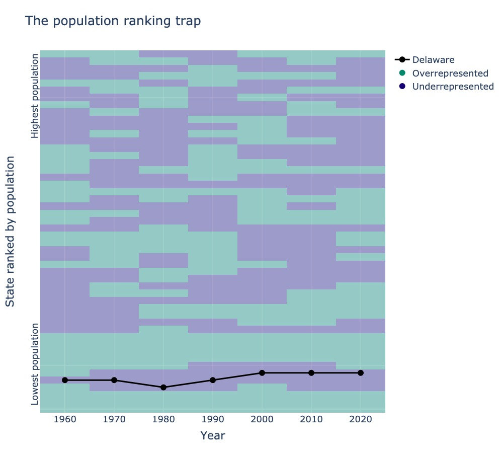
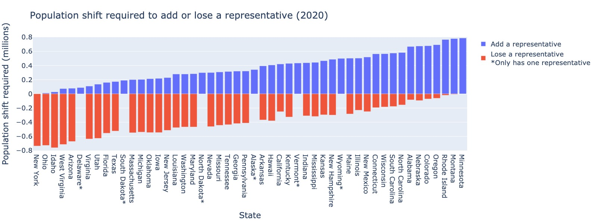
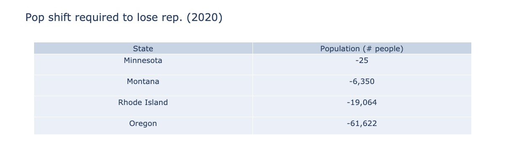

# House of representatives apportionments

`houseofreps` implements apportionment methods for assigning seats in the US House of Representatives.

**Read about this project:**
* [Sorry, Delaware, America’s most underrepresented state](https://medium.com/practical-coding/sorry-delaware-americas-most-underrepresented-state-83a8d654f864)
* [The impact of 25 people on Congressional voting](https://medium.com/practical-coding/the-impact-of-25-people-on-congressional-voting-d959e22baea1)

**Disclaimer: This product uses the Census Bureau Data API but is not endorsed or certified by the Census Bureau. See [Terms of Service](https://www.census.gov/data/developers/about/terms-of-service.html).**

Years supported:
```
1960, 1970, 1980, 1990, 2000, 2010, 2020
```

A detailed explanation of the current house seat apportionment algorithm can be found here: [https://www.census.gov/topics/public-sector/congressional-apportionment/about/computing.html](https://www.census.gov/topics/public-sector/congressional-apportionment/about/computing.html).

## Sample results


*The winners and losers of the 2020 Census and House of Representatives apportionments. The fair assignment value (horizontal line) is the total US population divided by the total number of representatives (435). If the number of residents per representative in each state is less than fair, the state is overrepresented; if it is greater, is is underrepresented. The winners in 2020 were Montana, Rhode Island, and Wyoming. The losers were West Virginia, Idaho, and Delaware.*


*The population ranking trap. The heatmap shows the states ranked by population for census reports from 1960–2020, with colors indicating whether the state was overrepresented or underrepresented for each decade. For population ranks in the mid-40s, a population ranking trap emerges (horizontal band of blue). Delaware (black) has had the misfortune of staying in this population ranking trap for the 70 years running.*


*Population shift required to add (blue) or lose (red) a representative based on the 2020 census data. The population shift redistributes people to the remainder of the U.S. in proportion to each state’s population (the total population of the U.S. is left unchanged). States are sorted by population required to add a representative. Note that some states cannot lose a representative, because they are already at the minimum (1). At the extremes: Minnesota requires just 25 people to move from the state to lose a representative. New York requires just 84 people to move to the state to add a representative.*


*Population shift required to lose a representative based on 2020 census data. Numbers are in raw number of people (not millions). See text for context.*

## Data source

The data source is from [https://www.census.gov](https://www.census.gov) and is completely described in the [data](data) folder.

## Installation

Install the Python package:
```bash
pip install houseofreps
```

You can validate that it worked by downloading the [example/example.py](example/example.py) script:
```bash
python example.py
```

Some examples are forthcoming.

**Local installation**: clone the repo, then:
```bash
pip install -r requirements.txt
pip install -e .
```

## Tests

Tests are implemented for `pytest`. In the `tests` folder run:
```bash
pytest
```

## Docs

Docs are built with `sphinx`. In the `docs` folder run:
```bash
make html
```

## Example usage

Further examples can be found in the analysis folder of the [GitHub repo](https://github.com/smrfeld/house-of-reps).

The main object is the `HouseOfReps` class. It can be instantiated with a year and population type:

```python
import houseofreps as hr
house = hr.HouseOfReps(
    year=hr.Year.YR2020, 
    pop_type=hr.PopType.APPORTIONMENT
    )
```

Calculate the total US population:

```python
pop = house.get_total_us_pop()
print(f"\tTotal US population in 2020: {pop:.2f} million")
```

Get the population of a state:

```python
pop_state = house.states[hr.St.CALIFORNIA].pop
print(f"\tPopulation of California in 2020: {pop_state:.2f} million")
```

Assign the house seats based on the current population using the priority method: 

```python
priorities = house.assign_house_seats_priority(return_priorities_top=True, return_priorities_all=False)
print(f"\tAssigned house seats. Priority assignment of 435th seat assigned: {priorities.priorities_top[435]}")
```

Get the number of reps assigned to a state:

```python
no_voting = house.states[hr.St.CALIFORNIA].no_reps.voting
print(f"\tNumber of voting reps assigned to California in 2020: {no_voting}")
no_nonvoting = house.states[hr.St.DISTRICT_OF_COLUMBIA].no_reps.nonvoting
print(f"\tNumber of nonvoting reps assigned to DC in 2020: {no_nonvoting}")
```

Shift some populations around, and recalculate seat assignments:

```python
print("Changing California population to 1 million")
house.states[hr.St.CALIFORNIA].pop = 1
priorities = house.assign_house_seats_priority(return_priorities_top=True, return_priorities_all=False)
print("\tChanged California population to 1 million")
```

Population of US after shifting population:

```python
pop = house.get_total_us_pop()
print(f"\tTotal US population in 2020 after change: {pop:.2f} million")
```

Get the number of reps assigned to a state after shifting population:

```python
no_voting = house.states[hr.St.CALIFORNIA].no_reps.voting
print(f"\tNumber of voting reps assigned to California in 2020 after change: {no_voting}")
```

Reset to the true values:

```python
house = hr.HouseOfReps(
    year=hr.Year.YR2020, 
    pop_type=hr.PopType.APPORTIONMENT
    )
print("Reset to true values")
```

Load the true seat assignments:

```python
st_to_true_data = hr.load_states_true()
print("Loaded true data")
print(f"\tTrue data for population of California: {st_to_true_data[hr.St.CALIFORNIA].year_to_pop}")
print(f"\tTrue data for no. reps of California: {st_to_true_data[hr.St.CALIFORNIA].year_to_no_reps}")
```

Find the minimum population *shift* (one state to the others) required to add a representative to a state:

```python
min_change = hr.find_min_pop_change_required_for_change_repr(
    year=hr.Year.YR2020,
    st=hr.St.NEW_YORK,
    target=hr.Target.ADD,
    pop_change_mode=hr.PopChangeMode.SHIFT_POP
    )
min_change = int(min_change*1e6) if min_change is not None else None
print(f"\tMinimum population change required to add a representative to New York in 2020: {min_change:d} people (*not* million)")

min_change = hr.find_min_pop_change_required_for_change_repr(
    year=hr.Year.YR2020,
    st=hr.St.CALIFORNIA,
    target=hr.Target.LOSE,
    pop_change_mode=hr.PopChangeMode.SHIFT_POP
    )
min_change = int(min_change*1e6) if min_change is not None else None
print(f"\tMinimum population change required to remove a representative from California in 2020: {min_change:d} people (*not* million)")
```

## Discussion

It's fascinating to understand how seats in the US House of Representatives are assigned. Before this project, I had never thought about this problem:
* The US Senate consists of two senators for every US state - this is straightforward.
* The US House of representatives has members assigned based on the state's population. This leads to an immediate problem: the fraction of people residing in each state doesn't lead to an integer assignment of seats!

What can we do?
* Fractional voting - assign each state a fractional vote. With modern technology, this actually seems like the more reasonable approach. However, this is not how the US House of Representatives is currently assigned.
* An algorithm that assigns members to each state. For every state, a choice must be made - is the number of seats rounded up or rounded down? Either way, some state has to pay the price and receive less seats.

A detailed explanation of the current house seat apportionment algorithm can be found here: [https://www.census.gov/topics/public-sector/congressional-apportionment/about/computing.html](https://www.census.gov/topics/public-sector/congressional-apportionment/about/computing.html). Every 10 years, the number of seats is assigned based on the latest census data (most recently: 2020).

For completeness, the description of algorithm is copied here from [https://www.census.gov/topics/public-sector/congressional-apportionment/about/computing.html](https://www.census.gov/topics/public-sector/congressional-apportionment/about/computing.html), with some comments:

The method assigns seats in the House of Representatives according to a "priority" value. The priority value is determined by multiplying the population of a state by a "multiplier."

Let `P` represent a state's total population. **This already generates some questions, particularly regarding overseas service members, who were excluded from the population counts in 1980 following the Vietnam war.**

All states start by receiving `1` seat. A state cannot receive less than one seat.

Next, let `n` represent the number of seats a state would have if it gained a seat (because all states automatically received one seat the next seat gained is "seat two," and the next "seat three," and the next "seat four," and so on.)

Now define the **multiplier**:
```
1/sqrt(n*(n-1))
```
[which is called the reciprocal of the geometric mean].

Thus the formula for calculating the multiplier for the second seat is:
```
1 / sqrt(2(2-1)) ~ 1/1.414213562 ~ 0.70710678
```
and the third seat is
```
1 / sqrt(3(3-1)) ~ 1/2.449489743 ~ 0.40824829
```

Once the "multipliers" have been calculated, the next step is to multiply this figure by the population total for each of the 50 states (**the District of Columbia is not included in these calculations**). The resulting numbers are the priority values.

Once you've calculated priority values for the total number of potential seats for each state, the next step is to rank and assign seat numbers to the resulting priority values starting with seat `51`, until all `435` seats have been assigned (remember, each state automatically received one seat). Next, tally the number of seats for each state to arrive at the total number of seats in the House of Representatives apportioned to each state.